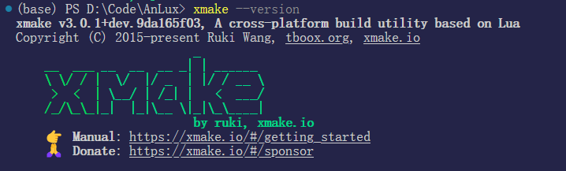
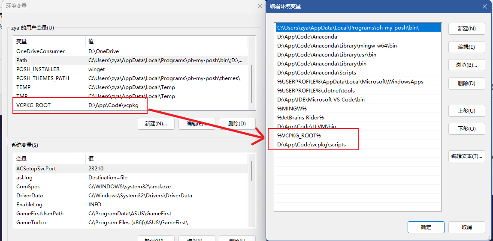
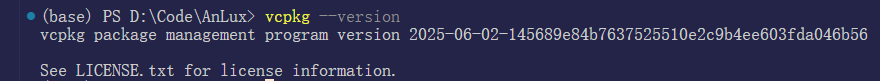
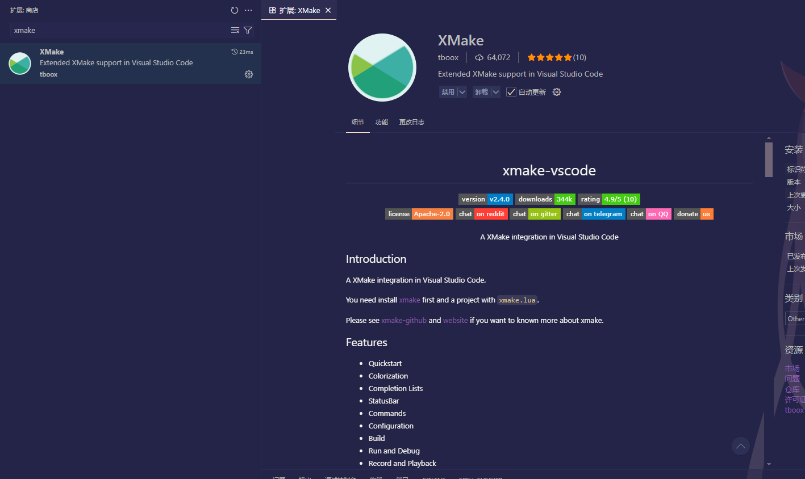
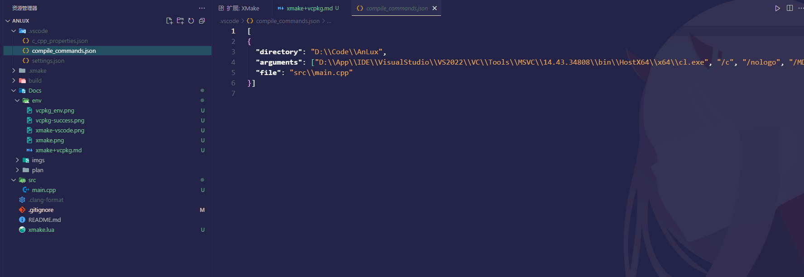
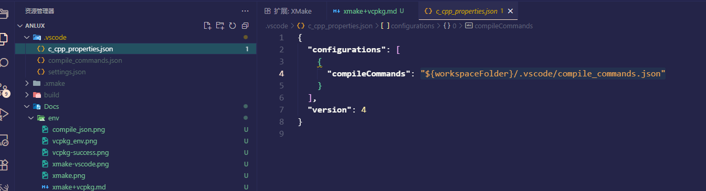
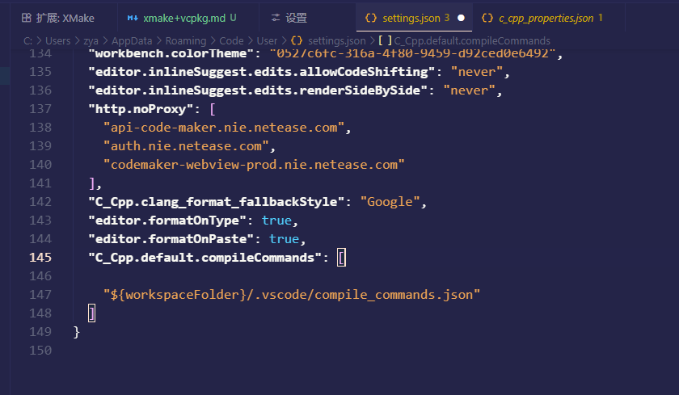

# xmake + vcpkg环境配置

# 1. xmake
[xmake-v3.0.0](https://github.com/xmake-io/xmake/releases/tag/v3.0.0)
官网下载并安装xmake最新版本。

# 2. vcpkg
## 2.1 下载vcpkg
选择github或者gitee镜像拉取
[vcpkg](https://github.com/microsoft/vcpkg)
[vcpkg-gitee](https://gitee.com/jackboosy/vcpkg)
拉取了国内镜像后后续的安装和包等还是拉的github的。 \
克隆后运行bootstrap-vcpkg.bat批处理文件，安装完成后目录下会有vcpkg.exe.如果失败大概率是网络问题。
## 2.2 环境变量
设置 $ VCPKG_ROOT 环境变量。xmake据此找vcpkg。

成功安装：

# 3. vscode
[vscode配置文档](https://xmake.io/#/zh-cn/plugin/more_plugins?id=vscode-%e6%8f%92%e4%bb%b6)
vscode 安装 XMake插件

配置好项目后，运行`xmake project -k compile_commands .vscode`生成.vscode下的copile_commands.json.

在c_cpp_properties.json中进行配置compilecommands。

或者也可以在设置中设定默认值
