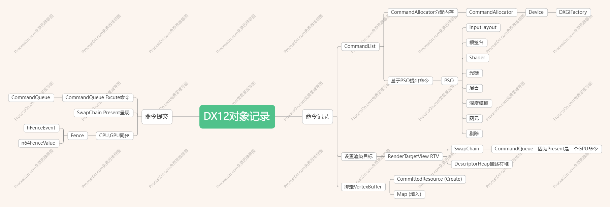
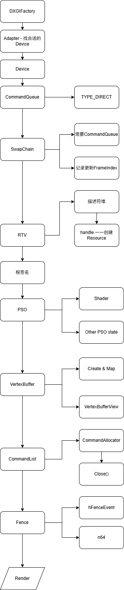

# DX12-0

Hello-Triangle.

# DX对象记忆
初始化的记忆太过于枯燥乏味。所以我想从渲染流程开始记录起。\
让我们回忆OpenGL的渲染流水线。OpenGL总体的流程非常简单，渲染循环之前需要数据准备 + 着色器准备 + 渲染状态准备。渲染循环中，首先要处理输入。渲染部分需要设定FBO，清除FBO，设定ViewPort，调用`glDrawElements`来绘制。数据准备部分采用VAO+VBO的方式，着色器编译并指定即可。渲染状态的切换和准备需要自己手动调用gl接口。资源需要绑定到全局的槽位上。\
DX12的渲染的流程往上抽象一下，其实和GL的比较相似，都需要数据准备 + 着色器准备 + 渲染状态准备。循环需要处理输入 + 设定视口 + 设定RTV（FBO） + 清除 + 绑定顶点缓冲 + 渲染。

## 现代图形API设计
现代图形API的设计我觉得可以归结如下：
1. “贴近硬件” (Closer to the Metal)
理念：API 的设计应该更直接地映射现代 GPU 的工作方式。GPU 并不理解一个全局的“状态”，它只理解包含所有必要信息（用哪个着色器、纹理在哪里等）的指令包。
体现：命令列表 (Command Lists) 和 管线状态对象 (PSOs) 就是这种理念的直接产物。它们组合起来，形成了一个接近硬件原生指令格式的“工作描述包”。
2. “显式优于隐式” (Explicit is Better than Implicit)
理念：驱动程序不应该猜测开发者的意图。所有重要的操作，尤其是那些耗费性能的操作，都应该由开发者明确地发起和控制。
体现：
同步 (Fences)：你必须明确地知道 GPU 工作到哪一步了，并手动等待。
内存管理 (Heaps/Resources)：你必须明确地分配内存，并管理资源的生命周期。
资源状态转换 (Resource Barriers)：你必须明确地告诉 GPU，一个资源将要从“被写入”（如作为渲染目标）切换到“被读取”（如作为纹理），这是为了处理硬件缓存和数据依赖。
3. “预计算所有能预计算的” (Pre-compute Everything Possible)
理念：将高成本的操作从渲染时 (Runtime) 转移到加载时 (Load-time)。渲染循环应该尽可能地“干净”和高效。
体现：管线状态对象 (PSO) 是这个理念的最佳范例。在 OpenGL 中，当你绑定一个新的着色器和不同的混合状态时，驱动程序可能需要在渲染时动态地验证这些状态组合是否有效，甚至重新编译硬件指令。而在 DX12 中，所有这些验证和编译工作都在 CreateGraphicsPipelineState 时一次性完成。在渲染循环中，切换整个渲染管线状态的成本几乎为零。
\
这样设计有什么好处呢？
- 消除 CPU 瓶颈：随着 GPU 越来越强大，CPU 反而成了瓶颈。旧 API 中，驱动程序在 CPU 上消耗了太多时间，导致 GPU 常常处于“饥饿”状态，等待 CPU 发来指令。通过命令列表和多线程渲染，现代 API 极大地释放了 CPU 的潜力，让 CPU 可以更快地“喂饱”强大的 GPU。

- 拥抱多核时代：现代 CPU 都是多核的。旧 API 的单线程模型无法有效利用这些核心。DX12 和 Vulkan 的设计从根本上就是并行的，允许开发者将渲染任务（如计算剔除、准备渲染指令）分散到所有可用的 CPU 核心上，实现性能的飞跃。

- 追求可预测的性能：在 OpenGL 中，一个 glDraw 调用可能会消耗 10 微秒，也可能因为驱动的“黑盒操作”而消耗 1000 微秒。这种不确定性让性能优化变得困难。在 DX12 中，因为一切都是显式的，性能变得高度可预测。你知道哪些操作是高成本的（比如创建 PSO），哪些是低成本的（比如绑定 PSO），从而可以做出更精准的性能优化。

## PSO
PSO是管线状态对象，是一个不可变的对象，包含了一次绘制调用所需的绝大部分硬件状态的快照。通过填充一个巨大的描述结构体`D3D12_GRAPHICS_PIPELINE_STATE_DESC`来创建。具体可以包含以下这些内容：
- RootSignature 根签名
  根签名是用来描述着色器用来需要访问哪些资源的，以及这些资源如何被绑定的。类似OpenGL中layout(binding = ...).
- 着色器
- BlendState
- RasterizerState
- 深度模板状态
- InputLayout 输入布局
- 图元拓扑 三角形啊 线啊 点啊
- RTVFormats

PSO可以一次创建，无限次使用。

## 多线程渲染设计（CPU多线程）
多线程有两种理解方式，一个是CPU的处理可以分为多个线程并行。PSO可以理解为一个预先批准的施工手册，那么多线程渲染就是多个施工队拿着各自的标准制定策略并记录，最终全部交给总施工方GPU施行。
### Command
命令是GPU运行的一个单位。CPU通过命令列表CommandList来记录命令，多个CommandList最终会提交到GPU的CommandQueue上，GPU会依次执行CommandQueue中的命令。CommandList需要CommandAllocator来分配内存。所以CommandList的构建是基于CommandAllocator。
### 渲染流程
主渲染线程开始一帧。每个线程获取自己专属的CommandAllocator，创建CommandList，绘制一个物体的时候调用SetPipeLineState绑定PSO。基于PSO记录指令。Close关闭命令列表。CommandQueue运行CommandLists。

## 同步
同步是非常重要的话题，因为CPU和GPU的通信现在是异步的，这样可以充分减少瓶颈。我们使用Fence来作为同步的核心对象，其实可以理解为一个锁。CPU使用Signal()来设置检查点，这个指令是让GPU运行到这儿的时候将Fence值更新为指定值。然后我们CPU会查询GPU的进度，获取GPU内当前的Fence值，如果已经更新到指定值就说明已经运行到这儿了。如果还没遇到那么就会需要接下来的等待,SetEventOnCompletion + WaitForSingleObject,此时此线程会睡眠，直到该数值被触发再通知我。

***
以上总结为下图  
  

# 渲染流程

